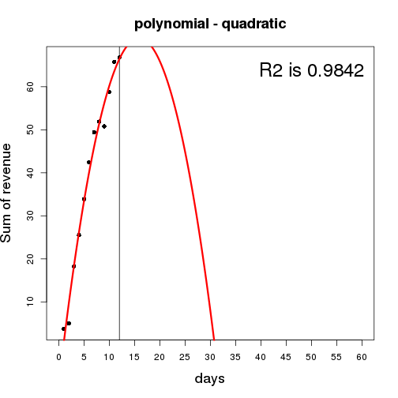
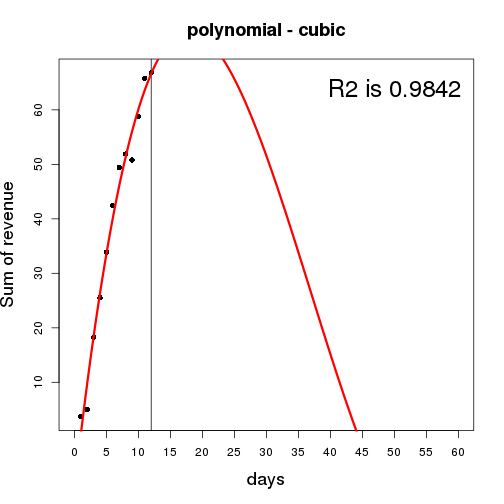

# Ximad Curves


```r
library(htmlTable)
library(pixiedust)
library(broom)
library(dplyr)
```

## Show data

```r
## read data 

df <- read.csv("./sample_data.csv")

## table of attributes
meaning <- c("number of campaigns", "number of days", "Sum of revenue")
features <- c("c1/c2/c3","days", "sum") 
table.df = cbind(features, meaning)
htmlTable(table.df)
```

<table class='gmisc_table' style='border-collapse: collapse;' >
<thead>
<tr>
<th style='border-bottom: 1px solid grey; border-top: 2px solid grey; text-align: center;'>features</th>
<th style='border-bottom: 1px solid grey; border-top: 2px solid grey; text-align: center;'>meaning</th>
</tr>
</thead>
<tbody>
<tr>
<td style='text-align: center;'>c1/c2/c3</td>
<td style='text-align: center;'>number of campaigns</td>
</tr>
<tr>
<td style='text-align: center;'>days</td>
<td style='text-align: center;'>number of days</td>
</tr>
<tr>
<td style='border-bottom: 2px solid grey; text-align: center;'>sum</td>
<td style='border-bottom: 2px solid grey; text-align: center;'>Sum of revenue</td>
</tr>
</tbody>
</table>

```r
## showing  data

htmlTable(df)
```

<table class='gmisc_table' style='border-collapse: collapse;' >
<thead>
<tr>
<th style='border-bottom: 1px solid grey; border-top: 2px solid grey;'> </th>
<th style='border-bottom: 1px solid grey; border-top: 2px solid grey; text-align: center;'>c1</th>
<th style='border-bottom: 1px solid grey; border-top: 2px solid grey; text-align: center;'>c2</th>
<th style='border-bottom: 1px solid grey; border-top: 2px solid grey; text-align: center;'>c3</th>
<th style='border-bottom: 1px solid grey; border-top: 2px solid grey; text-align: center;'>days</th>
<th style='border-bottom: 1px solid grey; border-top: 2px solid grey; text-align: center;'>sum</th>
</tr>
</thead>
<tbody>
<tr>
<td style='text-align: left;'>1</td>
<td style='text-align: center;'>1</td>
<td style='text-align: center;'>5</td>
<td style='text-align: center;'>5</td>
<td style='text-align: center;'>1</td>
<td style='text-align: center;'>3.67</td>
</tr>
<tr>
<td style='text-align: left;'>2</td>
<td style='text-align: center;'>3</td>
<td style='text-align: center;'>6</td>
<td style='text-align: center;'>6</td>
<td style='text-align: center;'>2</td>
<td style='text-align: center;'>5</td>
</tr>
<tr>
<td style='text-align: left;'>3</td>
<td style='text-align: center;'>13.8</td>
<td style='text-align: center;'>8</td>
<td style='text-align: center;'>33</td>
<td style='text-align: center;'>3</td>
<td style='text-align: center;'>18.27</td>
</tr>
<tr>
<td style='text-align: left;'>4</td>
<td style='text-align: center;'>20.8</td>
<td style='text-align: center;'>18.8</td>
<td style='text-align: center;'>37</td>
<td style='text-align: center;'>4</td>
<td style='text-align: center;'>25.53</td>
</tr>
<tr>
<td style='text-align: left;'>5</td>
<td style='text-align: center;'></td>
<td style='text-align: center;'>25.8</td>
<td style='text-align: center;'>42</td>
<td style='text-align: center;'>5</td>
<td style='text-align: center;'>33.9</td>
</tr>
<tr>
<td style='text-align: left;'>6</td>
<td style='text-align: center;'></td>
<td style='text-align: center;'>34.8</td>
<td style='text-align: center;'>50</td>
<td style='text-align: center;'>6</td>
<td style='text-align: center;'>42.4</td>
</tr>
<tr>
<td style='text-align: left;'>7</td>
<td style='text-align: center;'></td>
<td style='text-align: center;'>41.8</td>
<td style='text-align: center;'>57</td>
<td style='text-align: center;'>7</td>
<td style='text-align: center;'>49.4</td>
</tr>
<tr>
<td style='text-align: left;'>8</td>
<td style='text-align: center;'></td>
<td style='text-align: center;'>45.8</td>
<td style='text-align: center;'>58</td>
<td style='text-align: center;'>8</td>
<td style='text-align: center;'>51.9</td>
</tr>
<tr>
<td style='text-align: left;'>9</td>
<td style='text-align: center;'></td>
<td style='text-align: center;'>50.8</td>
<td style='text-align: center;'></td>
<td style='text-align: center;'>9</td>
<td style='text-align: center;'>50.8</td>
</tr>
<tr>
<td style='text-align: left;'>10</td>
<td style='text-align: center;'></td>
<td style='text-align: center;'>58.8</td>
<td style='text-align: center;'></td>
<td style='text-align: center;'>10</td>
<td style='text-align: center;'>58.8</td>
</tr>
<tr>
<td style='text-align: left;'>11</td>
<td style='text-align: center;'></td>
<td style='text-align: center;'>65.8</td>
<td style='text-align: center;'></td>
<td style='text-align: center;'>11</td>
<td style='text-align: center;'>65.8</td>
</tr>
<tr>
<td style='border-bottom: 2px solid grey; text-align: left;'>12</td>
<td style='border-bottom: 2px solid grey; text-align: center;'></td>
<td style='border-bottom: 2px solid grey; text-align: center;'>66.8</td>
<td style='border-bottom: 2px solid grey; text-align: center;'></td>
<td style='border-bottom: 2px solid grey; text-align: center;'>12</td>
<td style='border-bottom: 2px solid grey; text-align: center;'>66.8</td>
</tr>
</tbody>
</table>

## Linear model


```r
## model

times = seq(0, 60, 0.1)
lin.lm <- lm(sum ~ days, data = df)

## plot 

plot(df$days, df$sum, xaxt='n', pch=16, main="linear", ylab = "Sum of revenue", xlab="days", cex.lab=1.5, cex.main=1.5, xlim=c(0,60))
abline(lin.lm, col="red", lwd=3)
abline(v=length(df$days))
axis(1, at=seq(0,60,5), labels=seq(0,60,5))
legend("topright", bty="n", legend=paste("R2 is", format(summary(lin.lm)$r.squared,digits=4)), cex = 2.0)
```

 

```r
## table of statistics

stats = round(glance(lin.lm), 3)
htmlTable(stats)
```

<table class='gmisc_table' style='border-collapse: collapse;' >
<thead>
<tr>
<th style='border-bottom: 1px solid grey; border-top: 2px solid grey;'> </th>
<th style='border-bottom: 1px solid grey; border-top: 2px solid grey; text-align: center;'>r.squared</th>
<th style='border-bottom: 1px solid grey; border-top: 2px solid grey; text-align: center;'>adj.r.squared</th>
<th style='border-bottom: 1px solid grey; border-top: 2px solid grey; text-align: center;'>sigma</th>
<th style='border-bottom: 1px solid grey; border-top: 2px solid grey; text-align: center;'>statistic</th>
<th style='border-bottom: 1px solid grey; border-top: 2px solid grey; text-align: center;'>p.value</th>
<th style='border-bottom: 1px solid grey; border-top: 2px solid grey; text-align: center;'>df</th>
<th style='border-bottom: 1px solid grey; border-top: 2px solid grey; text-align: center;'>logLik</th>
<th style='border-bottom: 1px solid grey; border-top: 2px solid grey; text-align: center;'>AIC</th>
<th style='border-bottom: 1px solid grey; border-top: 2px solid grey; text-align: center;'>BIC</th>
<th style='border-bottom: 1px solid grey; border-top: 2px solid grey; text-align: center;'>deviance</th>
<th style='border-bottom: 1px solid grey; border-top: 2px solid grey; text-align: center;'>df.residual</th>
</tr>
</thead>
<tbody>
<tr>
<td style='border-bottom: 2px solid grey; text-align: left;'>1</td>
<td style='border-bottom: 2px solid grey; text-align: center;'>0.959</td>
<td style='border-bottom: 2px solid grey; text-align: center;'>0.955</td>
<td style='border-bottom: 2px solid grey; text-align: center;'>4.693</td>
<td style='border-bottom: 2px solid grey; text-align: center;'>232.882</td>
<td style='border-bottom: 2px solid grey; text-align: center;'>0</td>
<td style='border-bottom: 2px solid grey; text-align: center;'>2</td>
<td style='border-bottom: 2px solid grey; text-align: center;'>-34.485</td>
<td style='border-bottom: 2px solid grey; text-align: center;'>74.97</td>
<td style='border-bottom: 2px solid grey; text-align: center;'>76.425</td>
<td style='border-bottom: 2px solid grey; text-align: center;'>220.204</td>
<td style='border-bottom: 2px solid grey; text-align: center;'>10</td>
</tr>
</tbody>
</table>

```r
## table of coefficients

coeff = as.data.frame(dust(lin.lm) %>% sprinkle(round = 3))
htmlTable(coeff)
```

<table class='gmisc_table' style='border-collapse: collapse;' >
<thead>
<tr>
<th style='border-bottom: 1px solid grey; border-top: 2px solid grey;'> </th>
<th style='border-bottom: 1px solid grey; border-top: 2px solid grey; text-align: center;'>term</th>
<th style='border-bottom: 1px solid grey; border-top: 2px solid grey; text-align: center;'>estimate</th>
<th style='border-bottom: 1px solid grey; border-top: 2px solid grey; text-align: center;'>std.error</th>
<th style='border-bottom: 1px solid grey; border-top: 2px solid grey; text-align: center;'>statistic</th>
<th style='border-bottom: 1px solid grey; border-top: 2px solid grey; text-align: center;'>p.value</th>
</tr>
</thead>
<tbody>
<tr>
<td style='text-align: left;'>1</td>
<td style='text-align: center;'>(Intercept)</td>
<td style='text-align: center;'>0.431</td>
<td style='text-align: center;'>2.888</td>
<td style='text-align: center;'>0.149</td>
<td style='text-align: center;'>0.884</td>
</tr>
<tr>
<td style='border-bottom: 2px solid grey; text-align: left;'>2</td>
<td style='border-bottom: 2px solid grey; text-align: center;'>days</td>
<td style='border-bottom: 2px solid grey; text-align: center;'>5.988</td>
<td style='border-bottom: 2px solid grey; text-align: center;'>0.392</td>
<td style='border-bottom: 2px solid grey; text-align: center;'>15.26</td>
<td style='border-bottom: 2px solid grey; text-align: center;'>0</td>
</tr>
</tbody>
</table>


## Logarithmic model


```r
## model
log.lm <- lm(sum ~ log(days), data = df)
pred.log <- predict(log.lm, list(days=times))

## plot
plot(df$days, df$sum, xaxt='n', pch=16, main="logarithmic", ylab = "Sum of revenue", xlab="days",cex.lab=1.5, cex.main=1.5, xlim=c(0,60))
abline(v=length(df$days))
axis(1, at=seq(0,60,5), labels=seq(0,60,5))
lines(times, pred.log, col = "red", lwd = 3)
legend("topright", bty="n", legend=paste("R2 is", format(summary(log.lm)$r.squared,digits=4)), cex = 2.0)
```

 

## Exponential model


```r
## model (power)
exp.lm <- lm(log(sum) ~ days, data =df)
pred.exp <- exp(predict(exp.lm, list(days=times)))

## plot
plot(df$days, df$sum, xaxt='n', pch=16, main="exponential", ylab = "Sum of revenue", xlab="days",cex.lab=1.5, cex.main=1.5, xlim=c(0,60))
abline(v=length(df$days))
axis(1, at=seq(0,60,5), labels=seq(0,60,5))
lines(times, pred.exp, col="red", lwd=3)
legend("topright", bty="n", legend=paste("R2 is", format(summary(exp.lm)$r.squared,digits=4)), cex  = 2.0)
```

 

## Polynomial (quadratic)


```r
## model 2th degree
poly2.lm <- lm(sum ~ poly(days, 2), data =df)
pred.poly2 <- predict(poly2.lm, list(days=times))

## plot
plot(df$days, df$sum, xaxt='n', pch=16, main="polynomial - quadratic", ylab = "Sum of revenue", xlab="days",cex.lab=1.5, cex.main=1.5, xlim=c(0,60))
abline(v=length(df$days))
axis(1, at=seq(0,60,5), labels=seq(0,60,5))
lines(times, pred.poly2, col="red", lwd=3)
legend("topright", bty="n", legend=paste("R2 is", format(summary(poly2.lm)$r.squared,digits=4)), cex  = 2.0)
```

 

## Polynomial (cubic)


```r
## model 3th degree
poly3.lm <- lm(sum ~ poly(days, 3), data =df)
pred.poly3 <- predict(poly3.lm, list(days=times))

## plot
plot(df$days, df$sum, xaxt='n', pch=16, main="polynomial - cubic", ylab = "Sum of revenue", xlab="days",cex.lab=1.5, cex.main=1.5, xlim=c(0,60))
abline(v=length(df$days))
axis(1, at=seq(0,60,5), labels=seq(0,60,5))
lines(times, pred.poly3, col="red", lwd=3)
legend("topright", bty="n", legend=paste("R2 is", format(summary(poly3.lm)$r.squared,digits=4)), cex  = 2.0)
```

 

## Extracting R squared and Coefficients from models


```r
mod.list = list(lin.lm, log.lm, exp.lm, poly2.lm, poly3.lm)
mod.names = c("linear","logarithmic", "exponential","polynomial2", "polynomial3")
result.list = list()

for (i in seq(mod.list)) {
    stats = round(glance(mod.list[[i]]), 3)
    coeff = as.data.frame(dust(mod.list[[i]]) %>% sprinkle(round = 3))
    R.squared = stats$r.squared
    Intercept = coeff[1, 'estimate']
    Beta = coeff[2:nrow(coeff), 'estimate']
    Predictor = coeff[2:nrow(coeff), 'term']
    model.values = cbind(model = mod.names[i], Predictor, Beta, Intercept, R.squared)
    result.list[[i]] = model.values
     }


## collect all values  into table

result.table = do.call(rbind, result.list)
htmlTable(result.table)
```

<table class='gmisc_table' style='border-collapse: collapse;' >
<thead>
<tr>
<th style='border-bottom: 1px solid grey; border-top: 2px solid grey; text-align: center;'>model</th>
<th style='border-bottom: 1px solid grey; border-top: 2px solid grey; text-align: center;'>Predictor</th>
<th style='border-bottom: 1px solid grey; border-top: 2px solid grey; text-align: center;'>Beta</th>
<th style='border-bottom: 1px solid grey; border-top: 2px solid grey; text-align: center;'>Intercept</th>
<th style='border-bottom: 1px solid grey; border-top: 2px solid grey; text-align: center;'>R.squared</th>
</tr>
</thead>
<tbody>
<tr>
<td style='text-align: center;'>linear</td>
<td style='text-align: center;'>days</td>
<td style='text-align: center;'>5.988</td>
<td style='text-align: center;'>0.431</td>
<td style='text-align: center;'>0.959</td>
</tr>
<tr>
<td style='text-align: center;'>logarithmic</td>
<td style='text-align: center;'>log(days)</td>
<td style='text-align: center;'>28.274</td>
<td style='text-align: center;'>-7.738</td>
<td style='text-align: center;'>0.939</td>
</tr>
<tr>
<td style='text-align: center;'>exponential</td>
<td style='text-align: center;'>days</td>
<td style='text-align: center;'>0.238</td>
<td style='text-align: center;'>1.831</td>
<td style='text-align: center;'>0.769</td>
</tr>
<tr>
<td style='text-align: center;'>polynomial2</td>
<td style='text-align: center;'>poly(days, 2)1</td>
<td style='text-align: center;'>71.611</td>
<td style='text-align: center;'>39.356</td>
<td style='text-align: center;'>0.984</td>
</tr>
<tr>
<td style='text-align: center;'>polynomial2</td>
<td style='text-align: center;'>poly(days, 2)2</td>
<td style='text-align: center;'>-11.641</td>
<td style='text-align: center;'>39.356</td>
<td style='text-align: center;'>0.984</td>
</tr>
<tr>
<td style='text-align: center;'>polynomial3</td>
<td style='text-align: center;'>poly(days, 3)1</td>
<td style='text-align: center;'>71.611</td>
<td style='text-align: center;'>39.356</td>
<td style='text-align: center;'>0.984</td>
</tr>
<tr>
<td style='text-align: center;'>polynomial3</td>
<td style='text-align: center;'>poly(days, 3)2</td>
<td style='text-align: center;'>-11.641</td>
<td style='text-align: center;'>39.356</td>
<td style='text-align: center;'>0.984</td>
</tr>
<tr>
<td style='border-bottom: 2px solid grey; text-align: center;'>polynomial3</td>
<td style='border-bottom: 2px solid grey; text-align: center;'>poly(days, 3)3</td>
<td style='border-bottom: 2px solid grey; text-align: center;'>0.376</td>
<td style='border-bottom: 2px solid grey; text-align: center;'>39.356</td>
<td style='border-bottom: 2px solid grey; text-align: center;'>0.984</td>
</tr>
</tbody>
</table>
## Best model


```r
result.df = data.frame(result.table)
index.best = which.max(unique(result.df$R.squared))
best.name = as.character(unique(result.df$model)[index.best])

index.select = which(result.df$model %in% best.name)
best = result.df[index.select, ]
htmlTable(as.matrix(best))
```

<table class='gmisc_table' style='border-collapse: collapse;' >
<thead>
<tr>
<th style='border-bottom: 1px solid grey; border-top: 2px solid grey;'> </th>
<th style='border-bottom: 1px solid grey; border-top: 2px solid grey; text-align: center;'>model</th>
<th style='border-bottom: 1px solid grey; border-top: 2px solid grey; text-align: center;'>Predictor</th>
<th style='border-bottom: 1px solid grey; border-top: 2px solid grey; text-align: center;'>Beta</th>
<th style='border-bottom: 1px solid grey; border-top: 2px solid grey; text-align: center;'>Intercept</th>
<th style='border-bottom: 1px solid grey; border-top: 2px solid grey; text-align: center;'>R.squared</th>
</tr>
</thead>
<tbody>
<tr>
<td style='text-align: left;'>4</td>
<td style='text-align: center;'>polynomial2</td>
<td style='text-align: center;'>poly(days, 2)1</td>
<td style='text-align: center;'>71.611</td>
<td style='text-align: center;'>39.356</td>
<td style='text-align: center;'>0.984</td>
</tr>
<tr>
<td style='border-bottom: 2px solid grey; text-align: left;'>5</td>
<td style='border-bottom: 2px solid grey; text-align: center;'>polynomial2</td>
<td style='border-bottom: 2px solid grey; text-align: center;'>poly(days, 2)2</td>
<td style='border-bottom: 2px solid grey; text-align: center;'>-11.641</td>
<td style='border-bottom: 2px solid grey; text-align: center;'>39.356</td>
<td style='border-bottom: 2px solid grey; text-align: center;'>0.984</td>
</tr>
</tbody>
</table>


