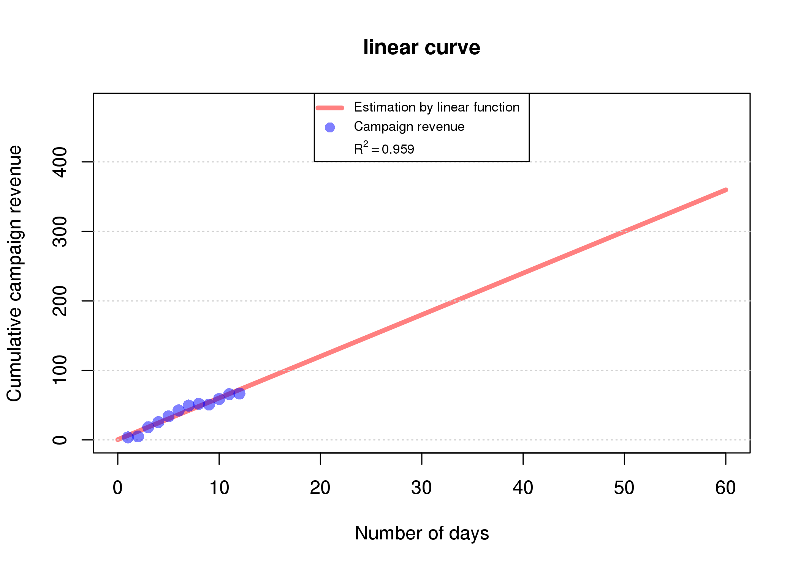
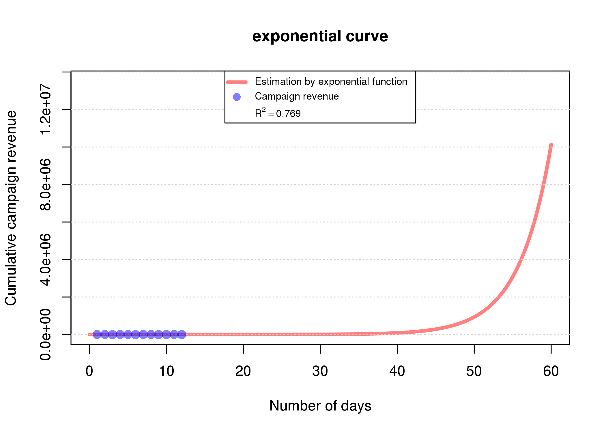
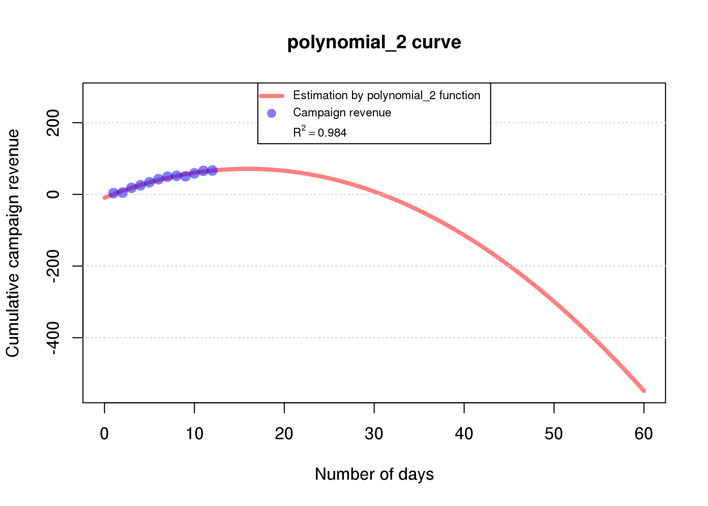

# Curve fitting prediction example


```r
library(htmlTable)
library(broom)
library(pixiedust)
library(dplyr)
library(pander)
library(data.table)
```
<br>

## Show data


```r
## read data 
df <- fread("./sample_data.csv")

## attribute description simple table
meaning <- c("number of campaign", "number of days", "Cumulative sum of campaigns revenue")
attribute <- c("c1/c2/c3","days", "cumsum_revenue") 
table.df = cbind(attribute, meaning)
kable(table.df, format = "markdown", align="c")
```


|   attribute    |               meaning               |
|:--------------:|:-----------------------------------:|
|    c1/c2/c3    |         number of campaign          |
|      days      |           number of days            |
| cumsum_revenue | Cumulative sum of campaigns revenue |

```r
## show data
kable(df, format = "markdown", align="c")
```


|  c1  |  c2  | c3 | days | cumsum_revenue |
|:----:|:----:|:--:|:----:|:--------------:|
| 1.0  | 5.0  | 5  |  1   |      3.67      |
| 3.0  | 6.0  | 6  |  2   |      5.00      |
| 13.8 | 8.0  | 33 |  3   |     18.27      |
| 20.8 | 18.8 | 37 |  4   |     25.53      |
|  NA  | 25.8 | 42 |  5   |     33.90      |
|  NA  | 34.8 | 50 |  6   |     42.40      |
|  NA  | 41.8 | 57 |  7   |     49.40      |
|  NA  | 45.8 | 58 |  8   |     51.90      |
|  NA  | 50.8 | NA |  9   |     50.80      |
|  NA  | 58.8 | NA |  10  |     58.80      |
|  NA  | 65.8 | NA |  11  |     65.80      |
|  NA  | 66.8 | NA |  12  |     66.80      |

<br>

## Curve fitting functions


```r
## timeseries for all curves
times = seq(0, 60, 0.1)


## CURVE FUNCTIONS 

linear <- function(y) {

    df$cumsum_revenue = y
    lin.lm <- lm(cumsum_revenue ~ days, data = df)
    pred.lin <- predict(lin.lm, list(days=times))
    return(list(lin.lm, pred.lin))
}


logarithmic <- function (y) {
    
    df$cumsum_revenue = y
    log.lm <- lm(cumsum_revenue ~ log(days), data = df)
    pred.log <- predict(log.lm, list(days=times))
    return(list(log.lm, pred.log))
}


exponential <- function (y) {
    
    df$cumsum_revenue = y
    exp.lm <- lm(log(cumsum_revenue) ~ days, data = df)
    pred.exp <- exp(predict(exp.lm, list(days=times)))
    return(list(exp.lm, pred.exp))
}


polynomial_2 <- function (y) {

    df$cumsum_revenue = y
    poly2.lm <- lm(cumsum_revenue ~ poly(days, 2), data = df)
    pred.poly2 <- predict(poly2.lm, list(days=times))
    return(list(poly2.lm, pred.poly2))
}


polynomial_3 <- function (y) {

    df$cumsum_revenue = y
    poly3.lm <- lm(cumsum_revenue ~ poly(days, 3), data = df)
    pred.poly3 <- predict(poly3.lm, list(days=times))
    return(list(poly3.lm, pred.poly3))
}


models = list("linear" = linear, 
              "logarithmic" = logarithmic,
              "exponential" = exponential, 
              "polynomial_2" = polynomial_2, 
              "polynomial_3" = polynomial_3)
```

<br>

## Save curves plot into list


```r
## create list for saving plots as object
plots = list()

## create list for assigning models name
name.list = list()


## loop every curve plot and save it as object into list

for (i in seq(models)) {

    # model name
    name = names(models)[i]

    # assign model name into list
    name.list[[i]] = name

    # function of model
    fun.model = models[[name]]

    # assign model coefficients and statistics 
    mod.val = fun.model(df$cumsum_revenue) [[1]]

    # assign prediction values
    pred.val = fun.model(df$cumsum_revenue) [[2]]

    # set the max ylim value
    not.infinite = pred.val[!is.infinite(pred.val)]
    ylim.max = max(not.infinite) + (max(not.infinite) + (-min(not.infinite)))/3

    # set the min ylim value
    not.infinite = pred.val[!is.infinite(pred.val)]
    ylim.min = min(not.infinite)

    # extrapolation plot
    plot(times, pred.val, xaxt='n', type="l", main=paste(name, "curve"), 
         ylab = "Cumulative campaign revenue", xlab="Number of days", 
         cex.lab=1.0, cex.main=1.1, ylim=c(ylim.min, ylim.max),
         xlim=c(0,60), col = '#FF00007F', lwd=4) 

    # add grid
    grid(NA, NULL)

    # add points from original data
    points(df$days, df$cumsum_revenue, col="#0000FF7F", pch = 16, cex = 1.4)

    # modificate the plot axis
    axis(1, at=seq(0,60,10), labels=seq(0,60,10))

    # add legend to a plot
    legend("top",  
           legend=c(paste("Estimation by", name, "function"), "Campaign revenue", 
           as.expression(bquote(
           R^2==.(format(summary(mod.val)$r.squared, digits=3))))),
           pch=c(NA,16),col=c("#FF00007F", "#0000FF7F"), 
           lwd = 4, lty=c(1,0,0), cex = 0.7, pt.cex = 1.2, 
           merge = T, y.intersp=2.0)

    # save every plot into list 'plots'
    plots[[i]] = recordPlot()

}   
```

```r
## assign model names into plots list
names(plots) = unlist(name.list)
```
<br>


## Linear model


```r
plots[["linear"]]
```



<br>

## Logarithmic model


```r
plots[["logarithmic"]]
```


<br>

## Exponential model


```r
plots[["exponential"]]
```



<br>

## Polynomial (quadratic)


```r
plots[["polynomial_2"]]
```



<br>

## Polynomial (cubic)


```r
plots[["polynomial_3"]]
```


<br>

## Sorted table by R squared value


```r
## lists for collecting stats with r.squared value
model.stats = list()
model.r.squared = list()


## loop for creating table with r squared values and models name 

for (i in seq(models)) {
    fun.model = models[[ name.list[[i]] ]]
    model.stats[[i]] = glance( fun.model(df$cumsum_revenue) [[1]] )        
    model.r.squared[[i]]  = round(model.stats[[i]]$r.squared, 3)
    results = data.table(cbind(Function = unlist(name.list), 
                            R.squared = unlist(model.r.squared)))
}

## sort results data.table by R.squared values
r.squared.table = results[ order(-R.squared) ]

## show r.squared.table 
kable(r.squared.table, align='c', format='markdown', row.names=T)
```


|   |   Function   | R.squared |
|:--|:------------:|:---------:|
|1  | polynomial_2 |   0.984   |
|2  | polynomial_3 |   0.984   |
|3  |    linear    |   0.959   |
|4  | logarithmic  |   0.939   |
|5  | exponential  |   0.769   |

<br>

## Fit campaigns to the best function


```r
## select campaigns from data
campaigns = df[, grep("c[0-9]", names(df)), with = F]

## best function index
best.index = which.max(results$R.squared)

## best function 
best.fun = models[[best.index]]


## campaigns curve fitting by best function

for (i in seq(campaigns)) {

    # assign single campaign into camp
    camp = campaigns[[i]]

    # campaign name
    name = names(campaigns)[i]

    # assign model coefficients and statistics 
    mod.val = best.fun(camp) [[1]]

    # assign prediction values
    pred.val = best.fun(camp) [[2]]

    # set the max ylim value
    not.infinite = pred.val[!is.infinite(pred.val)]
    ylim.max = max(not.infinite) + (max(not.infinite) + (-min(not.infinite)))/3

    # set the min ylim value
    not.infinite = pred.val[!is.infinite(pred.val)]
    ylim.min = min(not.infinite)

    # increase space between plots
    cat("<br/> <br/> <br/>")

    # predicted revenue head-line 
    pred = round(tail(pred.val, 1), 2)
    head = paste('Predicted revenue for campaign', name, "on 60th day is",
                pred, "€")
    pandoc.header(head, 4)
    pandoc.horizontal.rule()
    pandoc.horizontal.rule()

    
    # extrapolation plot
    plot(times, pred.val, xaxt='n', type="l", main=paste("Campaign", name), 
         ylab = "Predicted campaign revenue", xlab="Number of days", 
         cex.lab=1.0, cex.main=1.1, ylim=c(ylim.min, ylim.max),
         xlim=c(0,60), col = '#FF00007F', lwd=4) 

    # add grid
    grid(NA, NULL)

    # add points from original data
    points(df$days, camp, col="#0000FF7F", pch = 16, cex = 1.4)

    # modificate the plot axis
    axis(1, at=seq(0,60,10), labels=seq(0,60,10))

    # add legend to a plot
    legend("top", 
           legend=c(paste("Estimation by",  name.list[[best.index]],"function"),
                    "Campaign revenue", 
           as.expression(bquote(
           R^2==.(format(summary(mod.val)$r.squared, digits=3))))),
           pch=c(NA,16),col=c("#FF00007F", "#0000FF7F"), 
           lwd = 4, lty=c(1,0,0), cex = 0.7, pt.cex = 1.2, 
           merge = T, y.intersp=1.2)
}   
```

<br/> <br/> <br/>
#### Predicted revenue for campaign c1 on 60th day is 4544.55 €

---

---
<br/> <br/> <br/>
#### Predicted revenue for campaign c2 on 60th day is 280.11 €

---

---
<br/> <br/> <br/>
#### Predicted revenue for campaign c3 on 60th day is -2075.89 €

---

---


